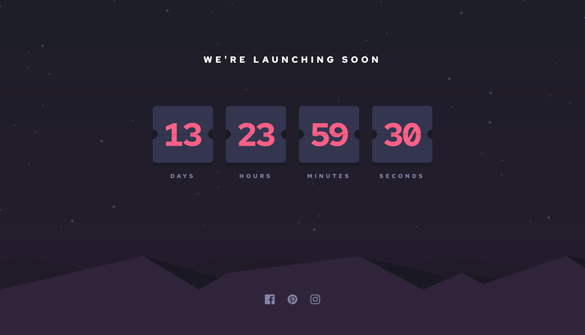

# Frontend Mentor - Launch countdown timer solution

This is a solution to the [Launch countdown timer challenge on Frontend Mentor](https://www.frontendmentor.io/challenges/launch-countdown-timer-N0XkGfyz-).

## Table of contents

- [Overview](#overview)
  - [The challenge](#the-challenge)
  - [Screenshot](#screenshot)
  - [Links](#links)
- [My process](#my-process)
  - [Built with](#built-with)
  - [What I learned](#what-i-learned)
  - [Continued development](#continued-development)
  - [Useful resources](#useful-resources)
- [Author](#author)

## Overview

### The challenge

Users can:

- See hover states for all interactive elements on the page
- See a live countdown timer that ticks down every second 
- When a number changes, the card flips from the middle

### Screenshot




### Links

- Solution URL: [https://www.frontendmentor.io/solutions/launch-countdown-timer-with-flip-animation-Xkjh9tkjfN](https://www.frontendmentor.io/solutions/launch-countdown-timer-with-flip-animation-Xkjh9tkjfN)
- Live Site URL: [https://launch-countdown-timer-liard.vercel.app/](https://launch-countdown-timer-liard.vercel.app/)

## My process

### Built with

- Web Animations API

### What I learned

This challenge was more difficult than I anticapted. While implementing the initial design was fairly straight forward, the flip counter was a challenge. I had to do a lot of research to find a solution that worked for me.

I found a few examples of flip counters and used them as a starting point to understand how a flip counter would work in html. I then implemented my own using the web animations API.

This is how I implemented the animation, for each unit we have the following:

```
<div class="time-unit seconds">
  <div class="time-bg">
    <div class="time-value">
      <div class="flap" aria-hidden="true">
        <div class="flap-back"></div>
        <div class="flap-front"></div>
      </div>
      <div class="time-card-top" aria-hidden="true"></div>
      <div class="time-card-line"></div>
      <div class="time-card-bottom"></div>
    </div>
  </div>
  <div class="time-label">Seconds</div>
</div>
```

We display the number in two part's the top half (.time-card-top) and the bottom half (.time-card-bottom). We then have a flap (.flap) that has a front (.flap-front) and a back (.flap-back). We set the flap-back to be behind the flap-front like so:

```
.flap-back {
    transform: rotateX(-180deg);
}
```

Then each interval of one second we:
  - update .time-card-top and .flap-back to the current second.
  - run the animation to flip the flap.
  - update .time-card-bottom and .flap-front to the next second.
  - reset the animation for the next interval

This is how we run the animation:
```
const animation = this.flaps[unit].animate([
  { transform: 'rotateX(0)' },
  { transform: 'rotateX(-180deg)' },
], {
  duration: 400,
  easing: 'ease-in-out',
  fill: 'forwards',
});

animation.onfinish = () => {
  // reset the animation so it can be played again
  this.flaps[unit].style.transform = 'rotateX(0)';
  // set the current time on the elements that are now hidden.
  this.flapFronts[unit].innerHTML = timeLeftString;
  this.unitBottoms[unit].innerHTML = timeLeftString;
};
```

### Continued development

There are some features I would implement for a production version of this site:
  - Timezones handling - At the moment the countdown is based on the user's local time. I haven't tested how this would work if the user is in a different timezone to the launch time.
  - On Complete handling - At the moment, when the timer hits zero, it just stops. It would be more useful to show a message or move the user to another page when the countdown is over.

### Useful resources

- [9 Free Open Source Flipping Clocks](https://1stwebdesigner.com/9-free-open-source-flipping-clocks-using-css-javascript/)  - These examples helped me think about how a flip counter would work.

- [Custom Corners](https://css-generators.com/custom-corners/) - This site helped me set the css for the clipped corners on the cards.

## Author

- Frontend Mentor - [@TomL](https://www.frontendmentor.io/profile/TomL)
- GitHub - [@TomL](https://github.com/toml)